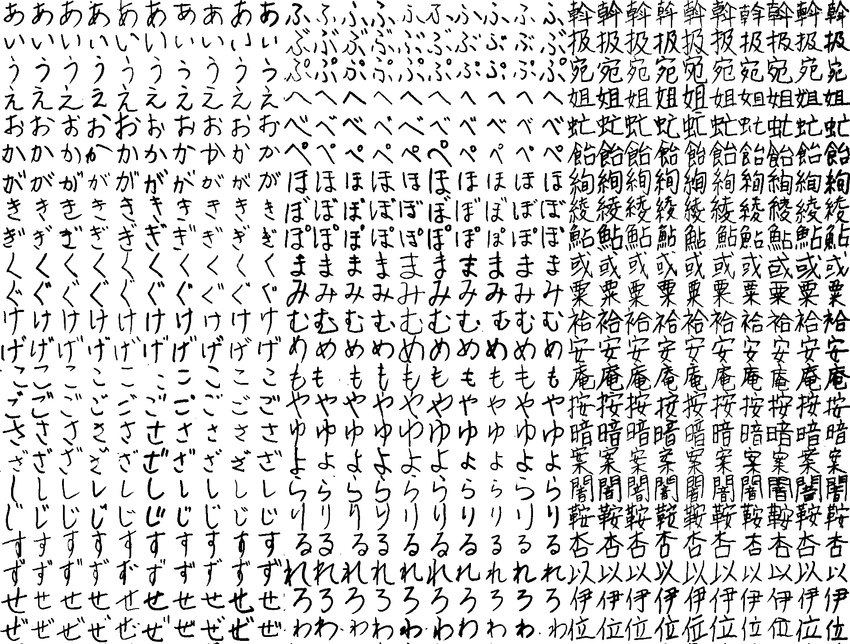

```{r setup, include=FALSE}
knitr::opts_chunk$set(echo = TRUE)
```

```{r echo=FALSE, message=FALSE, warning=FALSE}
library(knitr)


```

#Introduction

The goal of this project is to gather images of many hand-written Japanese characters and train an algorithm to guess the correct Japanese Character.  This is very similar to the MNIST digit reader data set.  A major problem we are faced with is that there is not a readily available database of handwritten Japanese characters.  Simply getting the data prepared and ready for analyis was a great undertaking that took most of the time that went into making this project.  The second major problem is that there are many different characters, making it more difficult for an algorithm to predict the correct character.  In the MNIST dataset, there are 10 different factors, 0-9.  The Japanese hiragana alphabet has more than 70 characters, resulting in a total of 74 factors.

There are thousands and thousands of Japanese kanji characters, but we will only be looking at the basic Japanese alphabet, called 'hiragana'.  
```{r, echo=FALSE}
library(knitr)


```
  
With many characters, the only difference between them is a small circle or two dashes in the top right corner. You can see this here.  This is "ha", "ba", and "pa".

```{r echo=FALSE, message=FALSE, warning=FALSE}
#CREATES THE 'HIRAGANA' DATAFRAME

library(tidyverse)

#opens file connection
my.file <- file('ETL8B2C1', 'rb')

#create elements
labels <- c()
image <- list()

# reads the first 512 bites, which are buffer
d <- readBin(my.file, raw(), n = 512L)

#reads 512 bytes at a time, 1 to 322 entries
for (i in 1:12000){
d <- readBin(my.file, raw(), n = 512L)

# read ascii character
labels[i] <- rawToChar(d[5:8])

# read image data
# reverse bytes
brev <- function(x) rev(rawToBits(x))
image[[i]] <- as.integer(paste(sapply(d[9:512],brev)))
}
close(my.file)
image <- matrix(unlist(image), ncol = 4032, byrow = TRUE)
```

```{r HA BA PA, echo=FALSE, fig.asp = .35, fig.align="center" }
rafalib::mypar(1,3)
image(matrix(image[6561,], 64, 63)[, 63:1], 
        main = labels[6561],
        xaxt="n", yaxt="n")
image(matrix(image[6721,], 64, 63)[, 63:1], 
        main = labels[6721],
        xaxt="n", yaxt="n")
image(matrix(image[6881,], 64, 63)[, 63:1], 
        main = labels[6881],
        xaxt="n", yaxt="n")
```

The data we will be using was gathered by the National Institute of Advanced Industrial Science and Technology (AIST)) under cooperation with the Japan Electronics and Information Technology Industries Association.  The data was collected between 1973 and 1984, and was made available for public download in 2011.  It is only to be used for academic purposes, and you must apply for permission to download it.  

Here is a link to the website.  http://etlcdb.db.aist.go.jp/  

There are 9 different zipped files with thousands and thousands of records.  Finding the record that included the data I was looking for took a good deal of investigation, as I was unfamiliar with their encoding style.  All of the data is just a string of bytes that you must read and decode based on the provided specifications.  You can find the specifications here.  http://etlcdb.db.aist.go.jp/?page_id=2461  

After sifting through the different files, I found that ETL-8B2 includes the hiragana characters I was looking for, and in a format similar to what we see in the MNIST digit reader data set.  The image data is represented by zeros and ones.

The ETL-8B2C1 file contains data for 360 different Japanese characters, each written by 160 different people.  Each record is 512 bytes.  To wrangle the data, we must read the file 512 bytes at a time, and decode the bytes into data we can use.  

Lets start by reading the first record in the data and see what we have.  The 2 main things we need is the name of the character, and an array of values representing the pixels of the image.  Here is the code used to get the first record.

```{r}
# open the file as readable byte 'rb'
my.file <- file('ETL8B2C1', 'rb')
# the first record is a buffer, and empty, so we wil skip the first 512 bytes 
# and go to the next 512 bytes
d <- readBin(my.file, raw(), n = 512L)
d <- readBin(my.file, raw(), n = 512L)
close(my.file)
# get name of hiragana character
lab <- rawToChar(d[5:8])
# get image data
img <- as.integer(rawToBits( d[9:512]))
lab
```

```{r broken A, echo=FALSE, fig.width=2, fig.height=2, fig.align="center" }
rafalib::mypar(1,1)
image(matrix(img, 64, 63)[, 63:1], 
        main = lab,
        xaxt="n", yaxt="n")
```

The "A.HI" means it is 'A' from the 'hiragana' alphabet.  When looking at the image, we see that it is very scrambled, but upon close inspection, we can see it somewhat resembles a Japanese 'A', but something is very wrong.  This particular issue caused me quite a bit of trouble.  

To understand what went wrong, we first need to understand how the image is encoded.  Eeach image is 64 x 63 pixels and 504 bytes.  Eech byte must be changed to binary.  One byte can be represented by 8 binary digits.  504 bytes x 8 digits = 4,032.  64 x 63 also equals 4,032.  So we change all bytes to binary and then turn this binary array of length 4032 into a 64 x 63 matrix, then show the image of the matrix.  Here is an example of changing a byte to binary.  

```{r}
a <- as.raw(5)
a
b <- rawToBits(a)
b
```

As it turns out, when coercing raw data to binary using the rawToBits() function, R puts the most significant digit on the right; however, this is not how the data was meant to be read.  The most significant digit needs be on the left.  This causes every 8 pixels to be flipped.  If we reverse the order of every 8 binary digits, the image comes out as intended.  We do this using sapply and the rev() function.  

```{r}
my.file <- file('ETL8B2C1', 'rb')
d <- readBin(my.file, raw(), n = 512L)
d <- readBin(my.file, raw(), n = 512L)
close(my.file)
lab <- rawToChar(d[5:8])
brev <- function(x) rev(rawToBits(x))
img <- as.integer(paste(sapply(d[9:512],brev)))
```

```{r fixed A, echo=FALSE, fig.width=2, fig.height=2, fig.align="center" }
rafalib::mypar(1,1)
image(matrix(img, 64, 63)[, 63:1], 
        main = lab,
        xaxt="n", yaxt="n")
```

The next step is to read the whole file and save it to data we can use for machine learning.  Here is the code.

```{r, CREATE THE HIRAGANA DATA, eval=FALSE , echo=TRUE}
#CREATES THE 'HIRAGANA' DATAFRAME

library(tidyverse)

#opens file connection
my.file <- file('ETL8B2C1', 'rb')

#create elements
labels <- c()
image <- list()

# reads the first 512 bites, which are buffer
d <- readBin(my.file, raw(), n = 512L)

#reads 512 bytes at a time, 1 to 322 entries
for (i in 1:12000){
d <- readBin(my.file, raw(), n = 512L)

# read ascii character
labels[i] <- rawToChar(d[5:8])

# read image data
# reverse bytes
brev <- function(x) rev(rawToBits(x))
image[[i]] <- as.integer(paste(sapply(d[9:512],brev)))
}
close(my.file)
labels <- as.factor(labels)
image <- matrix(unlist(image), ncol = 4032, byrow = TRUE)
```

Let's look at the structure of our data.  

```{r}
str(labels)
str(image)
```

It is not a data frame.  Instead, there are 2 objects, 'labels' and 'images'.  The object, 'labels', is an array of 72 unique character strings.  It is in the form of characters because it still needs small adjustments before being converted to factors.  We will get to that later.  The obect, 'image', is a large 12000 x 4032 matrix.  Each row represents one image.  If we want to view the image, we can reshape the row into a 64 x 63 matrix.  

Let's check that we actually have 160 entries for each character.  

```{r}
table(labels)
```

We notice that the labels "ZU.H", "JI.H", and "TSU." have 320 entries.  This is because there are two different ways to write these characters.  

```{r zu ji tsu, echo=FALSE, fig.width=12, fig.height=2, fig.align="center" }
rafalib::mypar(1,6)
for (i in c(4961,3201,2881, 4481,4641,4890)){
image(matrix(image[i,], 64, 63)[, 63:1], 
        main = labels[i],
        xaxt="n", yaxt="n")}
```

We will need to split each of these in half.  "ZU.H" will become "ZU.H" and "SUZU".  "JI.H" will become "JI.H" and "CHIJI".  "TSU" can actually stay the same because the ony difference is size, but the images have been normalized so even a small 'TSU' will appear the same as its larger counterpart.  

```{r}
labels[3201:3360] <- "SUZU"
labels[4481:4640] <- "CHIJI"
labels <- as.factor(labels)
```

# Methods  

The first step in creating and testing a model is to partition our data into train and test sets.  We will randomly seperate using the sample() function, 90% train and 10% test.  

```{r}
set.seed(1983)
index <- sample(12000, 1200)

y_train<-factor(labels[-index])
x_train <- image[-index,]

y_test<-factor(labels[index])
x_test <- image[index,]
```

I was hoping to apply numerous machine learning methods to this data set, and finally make an ensemble.  After attempting a few, I discovered that the run times were very long, and often didn't finish.  To try to alleviate this issue, we will attempt some dimension reduction.  

First, We will use the nearZeroVar() function from the caret package.  This function identifies the columns that have very low variation.  These columns will not help us differentiate between hiragana characters, so they should be ignored.  Let's look at which pixels we keep (red), and which we ignore.  

```{r echo=FALSE, message=FALSE, warning=FALSE}
library(caret)
colnames(x_train) <- 1:4032
colnames(x_test) <- colnames(x_train)
nzv <- nearZeroVar(x_train)
image(matrix(1:4032 %in% nzv, 64,63))
col_index <- setdiff(1:ncol(x_train), nzv)
```

We keep 3345 columns of our 4032 original columns.  

Next, we calculate the principal components using the prcomp() function to identify the columns that describe the most amount of variability in the data.  The runtime on this can be quite long, up to 10 minutes.  

```{r, echo = FALSE}
col_means <- colMeans(x_train[,col_index])
# calculating the pca takes up to 10 minutes
pca <- prcomp(x_train[,col_index])

plot(pca$sdev[1:3345])
```

This plot shows us principal components in order of most variability to least variability.  Notice there are only about 20 columns that have variance above 2.  Everything else is very low in comparison.  

```{r, echo =FALSE}
summary(pca)$importance[,1:8] %>% knitr::kable()
```

This table is quite useful as it shows the proportion of the data that can be described by each principal component.  When using this method of dimension reduction on the MNIST data, we noticed that the first 36 columns described more than 80% of the data.  Sadly, we do not get such results here.  Even with all the PCs from PC1 to PC100, we get a cumulative proportion of about 65%.  

```{r, echo =FALSE}
summary(pca)$importance[,95:101] %>% knitr::kable()
```

The last thing to do is train the algorithm and test it.  

```{r echo=TRUE, warning=FALSE}
K <- 30
x_train_pca <- pca$x[,1:K]
fit <- knn3(x_train_pca, y_train)
#transform the test set
x_test_pca <- sweep(x_test[,col_index], 2, col_means) %*% pca$rotation
x_test_pca <- x_test_pca[,1:K]
# make predictions and see results
y_hat <- predict(fit, x_test_pca, type = "class")
results <- confusionMatrix(y_hat, factor(y_test))
results$overall[1]
```


# Results  
When using almost the exact same method on the MNIST data set, we got above 0.97 accuracy.  Here, we get an accuracy of about 0.82.  Let's look at the Sensitivity and Specificity to see where the mistakes are being made.  

```{r}
which(results$byClass[,1]<.6)
```

These are the factors that received a sensitivity less than 0.6,  These characters are the ones that are identified only by two dashes or a circle in the top-right corner (excluding 'WA').  It seems this is a major issue for this algorithm.  

One possible solution is to use a second algorithm that focuses only on the rop-right part of each image to try to identify if it has two dashes, a circle, or neither.  This is an extra challenge that I am not prepared to undertake at this time.  

# Conclusion  

Machine learning can be used to identify handwritten Japanese hiragana characters.  Here, we used the KNN method.  We did not achieve an accuracy as high as we did in the MNIST digit reader data set, but we still did pretty well, achieving an accuracy of 0.82.  The issue that caused most of the mistakes was due to many characters looking identical, except for one mark in the corner.  

The major difficulty in this project was wrangling the data.  Reading raw data and converting it into usable objects took a lot of experimentation.  It took weeks to understand the encoding and write code that could convert it into data in the form we needed.  

A second issue was in run times.  Many of the methods in the caret package are not usable on this data set due to the high number of columns.  I feel like with a lot of tinkering, one could overcome this issue through dimension reduction, but I am more than satisfied with what we have accomplished already.  

Thank you for taking the time to read this report.  I hope you learned something, I know I did!
